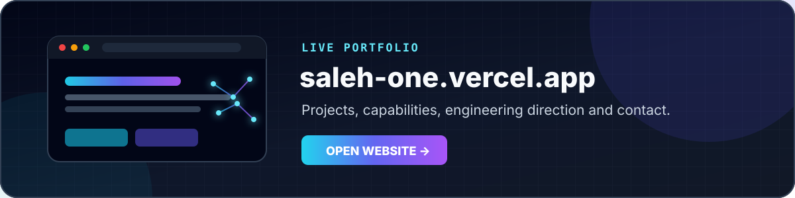

<div align="center">


<br/>

<a href="https://saleh-one.vercel.app/"><b>Personal Website</b></a>
&nbsp;•&nbsp;
<a href="https://github.com/Saleh2005e?tab=repositories"><b>Projects</b></a>
&nbsp;•&nbsp;
<a href="mailto:ls5601108@gmail.com"><b>Contact</b></a>

</div>

## `01 / Identity`

I am **Saleh Elsaity**, an AI and software engineering developer from Libya focused on building intelligent systems that move from an idea to a working real-world product.

My work sits at the intersection of **artificial intelligence, computer vision, robotics, backend systems, modern web applications, automation, and infrastructure**.

```text
Input → Perception → Decision → Control → Feedback
```

- Building AI-powered applications and computer-vision systems
- Developing robotics software and FTC control systems
- Designing full-stack products, dashboards, and backend services
- Exploring automation, cybersecurity, deployment, and self-hosted infrastructure
- Advancing continuously in software engineering and applied AI

## `02 / Personal Website`

<a href="https://saleh-one.vercel.app/">
  
</a>

My personal website presents my projects, technical capabilities, engineering direction, and contact information in one place.

**Live website:** [saleh-one.vercel.app](https://saleh-one.vercel.app/)

## `03 / Featured Engineering Projects`

<table>
<tr>
<td width="50%" valign="top">

### 🔥 [Fire Detection System](https://github.com/Saleh2005e/Fire-Detection-System)

Real-time computer-vision system for detecting fire using **YOLOv8**, with confidence-based bounding boxes, event logging, configurable detection sensitivity, and instant Telegram alerts.

**Engineering value**
- Real-time inference pipeline
- Vision-based event detection
- Automated alert delivery
- Desktop monitoring interface

`Python` `YOLOv8` `OpenCV` `PyTorch` `Telegram API`

</td>
<td width="50%" valign="top">

### 🎙️ [Arabic AI Voice Assistant](https://github.com/Saleh2005e/AI-arabic-voice-assistant)

Arabic voice-assistant prototype featuring wake-word activation, speech interaction, NLP-oriented processing, a graphical dashboard, and configurable behavior.

**Engineering value**
- Arabic-focused voice interaction
- Activation and response workflow
- Speech output integration
- GUI-driven control

`Python` `NLP` `gTTS` `Tkinter` `Pygame`

</td>
</tr>
</table>

## `04 / Core Engineering Domains`

<table>
<tr>
<td width="33%" valign="top">

### AI Engineering

- Applied machine learning
- Computer vision
- Arabic intelligent assistants
- Model integration
- Inference workflows

</td>
<td width="33%" valign="top">

### Robotics & Control

- FTC robot software
- Sensor integration
- Control logic
- TeleOp systems
- Autonomous behavior

</td>
<td width="33%" valign="top">

### Software Systems

- Full-stack applications
- Backend architecture
- Dashboards and admin systems
- Automation and deployment
- Linux-based infrastructure

</td>
</tr>
</table>

## `05 / Technical Arsenal`

### Languages

`Python` `JavaScript` `Java` `C++` `C#` `PHP`

### AI, Vision and Data

`PyTorch` `TensorFlow` `OpenCV` `YOLO` `NumPy` `Keras` `NLP`

### Robotics and Engineering

`FTC SDK` `Arduino` `Android` `Control Systems` `Sensor Integration` `NVIDIA CUDA`

### Web, Backend and Infrastructure

`Node.js` `TanStack` `Supabase` `Docker` `Linux` `Git` `REST APIs` `Vercel`

## `06 / Current Development Vector`

```yaml
ai_engineering:
  - computer_vision
  - intelligent_assistants
  - applied_machine_learning

robotics:
  - FTC_control_systems
  - sensor_integration
  - autonomous_behavior

software_engineering:
  - full_stack_products
  - backend_architecture
  - automation_and_deployment
```

## `07 / Engineering Principles`

```text
Build for operation, not only demonstration.
Measure before optimizing.
Prefer clear architecture over accidental complexity.
Connect intelligence to real inputs, decisions, and actions.
```

## `08 / Connect`

- **Website:** [saleh-one.vercel.app](https://saleh-one.vercel.app/)
- **GitHub:** [github.com/Saleh2005e](https://github.com/Saleh2005e)
- **Facebook:** [facebook.com/Saleh2005e](https://facebook.com/Saleh2005e)
- **Instagram:** [instagram.com/saleh_elsaity_2005](https://instagram.com/saleh_elsaity_2005)
- **Email:** [ls5601108@gmail.com](mailto:ls5601108@gmail.com)

---

<div align="center">

### Designing intelligent systems that connect perception, software, and real-world action.

</div>
