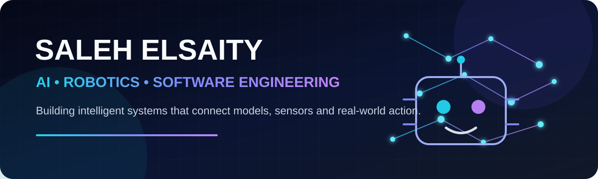

<div align="center">



<br/>

[](https://github.com/Saleh2005e)
[](https://github.com/Saleh2005e?tab=followers)
[](https://facebook.com/Saleh2005e)
[](https://instagram.com/saleh_elsaity_2005)
[](mailto:ls5601108@gmail.com)

</div>

## `> whoami`

I am **Saleh Elsaity**, an AI and software engineering developer from Libya focused on building intelligent systems that move from an idea to a working real-world product.

My work sits at the intersection of **artificial intelligence, computer vision, robotics, backend systems, and modern web applications**. I am particularly interested in systems that combine models, sensors, automation, and reliable software architecture.

```text
Input → Perception → Decision → Control → Feedback
```

- Building AI-powered applications and computer-vision systems
- Developing robotics software and FTC control systems
- Designing full-stack products, dashboards, and backend services
- Exploring cybersecurity, automation, and self-hosted infrastructure
- Currently advancing my software engineering and applied AI skills

## Featured Engineering Projects

<table>
<tr>
<td width="50%" valign="top">

### 🔥 [Fire Detection System](https://github.com/Saleh2005e/Fire-Detection-System)

Real-time computer-vision system for detecting fire with **YOLOv8**, confidence-based bounding boxes, event logging, and instant Telegram alerts.

`Python` `YOLOv8` `OpenCV` `PyTorch` `Telegram API`

</td>
<td width="50%" valign="top">

### 🎙️ [Arabic AI Voice Assistant](https://github.com/Saleh2005e/AI-arabic-voice-assistant)

Arabic voice-assistant prototype featuring wake-word activation, speech interaction, NLP-oriented processing, a graphical dashboard, and configurable behavior.

`Python` `NLP` `gTTS` `Tkinter` `Pygame`

</td>
</tr>
</table>

## Technical Arsenal

### Languages


### AI, Vision and Robotics


### Software and Infrastructure


## Current Focus

```yaml
ai_engineering:
  - computer_vision
  - intelligent_assistants
  - applied_machine_learning

robotics:
  - FTC_control_systems
  - sensor_integration
  - autonomous_behavior

software_engineering:
  - full_stack_web
  - backend_architecture
  - automation_and_deployment
```

## GitHub Analytics

<div align="center">


<br/>


</div>

## Engineering Principle

> Build systems that are measurable, maintainable, and capable of operating beyond the demo.

<div align="center">

### Let us build something intelligent.

[](https://github.com/Saleh2005e?tab=repositories)
[](mailto:ls5601108@gmail.com)

</div>
